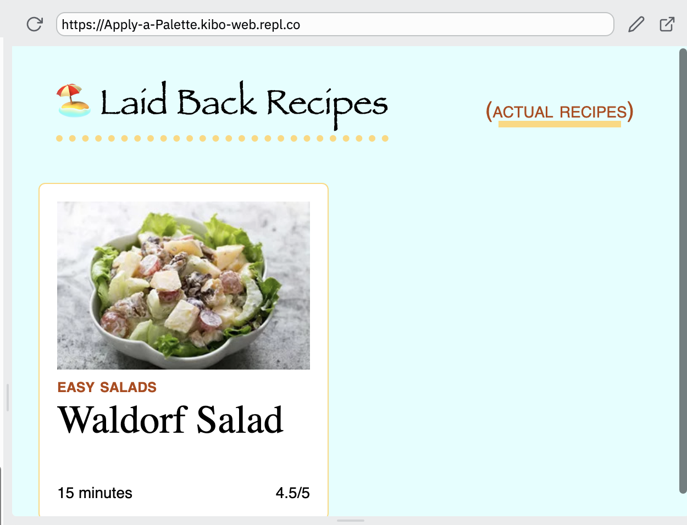

# Apply a Palette

This recipe card site is starting to look like a real site! The text styles and spacing make it look 'real'.

It needs a splash of color. Pick some colors and make it look stunning!

## Instructions

1. Go to [Coolors](https://coolors.co/generate) to create a palette
2. Apply those colors to the site
3. Check your colors for readability and contrast

### What colors to pick?

In `style.css`, there are comments for the different spots where you can pick a color.

Remember, fewer colors is better!

Your palette should probably have about 4 colors:

- body text color
- background color
- 1 or 2 accent colors

You can use https://coolors.co/contrast-checker to check that you have enough contrast between your text and background.

### Example

Here's one completed version of the site (you don't have to pick these colors!):

## Bonus: CSS Variables

If you want, try using CSS variables for your colors. 

* Add the variables to the root element selector `html` in the stylesheet.
* Replace the values in the rest of your stylesheet with `var(--accent)`, `var(--body)`, or whatever you called your variables.

### Attribution

Recipe description, and link from https://www.simplyrecipes.com/. Check out their site - it makes pretty nice color choices!